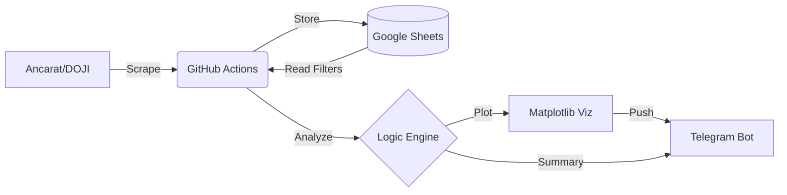

# SilverCloud Tracker 🚀

**Serverless Financial Intelligence & Automated Data Pipeline**


---

A professional-grade data engineering solution that automates the extraction, transformation, and visualization of precious metal market data. Designed to run on a zero-cost infrastructure using GitHub Actions and Google Cloud.

## 💎 Key Features

- **Serverless Orchestration**: Fully automated execution via GitHub Actions (CRON: 10:00 & 17:00 ICT).
- **Multi-Source ETL**: High-resilience web scraping from leading providers (Ancarat & DOJI).
- **Automated Data Lake**: Direct integration with Google Sheets API for persistent, cloud-accessible storage.
- **Intelligent Investment Analytics**: Calculates "Investment Gaps" (Current Buy Price vs. Personal Entry Price) in real-time.
- **Visual Reporting**: Generates high-fidelity time-series charts (Matplotlib/Pandas) for monthly, quarterly, and annual trends.
- **Instant Notifications**: Real-time Telegram delivery of price summaries and analytical charts.

## 🏗 Architecture



## 🛠 Tech Stack

- **Runtime**: Python 3.x
- **Data Handling**: Pandas, NumPy
- **Automation**: GitHub Actions (YAML CI/CD)
- **Cloud APIs**: Google Sheets API, Google Drive API, Telegram Bot API
- **Visualization**: Matplotlib (Agg backend)
- **Scraping**: BeautifulSoup4, Requests

## 📈 Intelligent Analytics

The system doesn't just track prices; it tracks **ROI**. By maintaining a `filter` sheet, the crawler calculates:

> `Gap = Current_Market_Buy_Price - Your_Investment_Price`

This allows the bot to notify you exactly when your silver assets have outperformed your entry price.

## 🚀 Quick Setup

1.  **Clone the infrastructure**:
    ```bash
    git clone https://github.com/your-username/silver-price-tracker.git
    ```
2.  **Configure Environment**:
    Populate GitHub Secrets with `G_SHEET_JSON`, `TG_TOKEN`, and `TG_CHAT_ID`.
3.  **Define Targets**:
    Add your physical silver products to the `filter` tab in your Google Sheet.
4.  **Activate**:
    Enable GitHub Actions and run the first sync!

## 📁 Repository Structure

| Path                 | Description                                 |
| :------------------- | :------------------------------------------ |
| `/cloud`             | Core cloud-native production code           |
| `/.github/workflows` | Pipeline orchestration (YAML)               |
| `/data`              | (Optional) Local historical CSV storage     |
| `cloud_crawler.py`   | The "Brain" - Scraper, Parser, and Analyzer |

---

## 👨‍💻 Engineering Note

This project was engineered to demonstrate how to build a robust financial monitoring tool with **zero infrastructure costs**. By leveraging GitHub Actions as a compute engine and Google Sheets as a database, the system is highly scalable and costs $0/month to operate.

---

_Disclaimer: This tool is for informational purposes only. Investment in precious metals involves risk._
